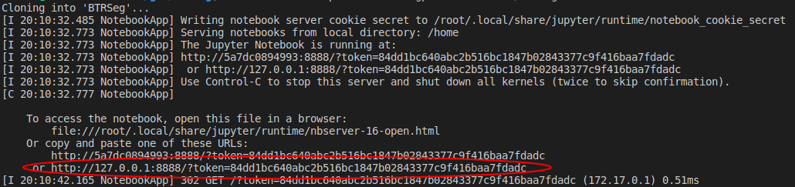

# BTRSeg
Repository related to the IA369Z reproducible Brain Tumor Segmentation project.

# Data
The notebooks will download the data automatically from a Figshare private link to the data folder.
Note that this data should not be distributed without first submitting a data request in the original source: https://www.med.upenn.edu/cbica/brats2020/

# Usage with Google Colab

Google provides a remote computing free service called Google Colaboratory. Although there are time limits for using a GPU,
you can have a look at the executable paper in Google Colaboratory following this link:

https://colab.research.google.com/drive/1PJiAdfYeaokWFWmFnzbUvZoulSaKODHu?usp=sharing

Make sure you go to Runtime -> Change Runtime Type and select a GPU to be able to use a GPU.

# Usage with Docker

## Requirements for running with Docker
Tested only with Ubuntu 18.04, support for other OS is not guaranteed\
Docker >= 19.03.11\
Recommended 8 GB RAM or more\
NVidia driver version >= 440.33\
NVidia GPU supporting CUDA 10.2

If you don't have an appropriate GPU, check the Google
Colaboratory version of the executable paper, where you can run some experiments using the google provided enviroment.

## Docker Installation

Follow the tutorial in: https://docs.docker.com/engine/install/ubuntu/
The image was tested with **Docker 19.03.11**. Make sure you have this version or newer to be able to use GPUs.

CUDA and cuDNN are already configured in the image.

## Running Executable Paper from Docker
Open terminal and pull the image from docker hub (10.6 GB, includes data):

        sudo docker pull dscarmo/btrseg

Make sure you are not running a jupyter server yourself on port 8888, and run this command:

        sudo docker run -p 8888:8888 --gpus all dscarmo/btrseg

This will start a jupyter notebook server in the image enviroment. Go to your browser and access the link reported
by the jupyter initialization, which will have the correct token for security (example link in red bellow).

There you will find the code from this repository, including the compressed original data, and the executable paper in
ExecutablePaper.ipynb. Open it and follow the paper.

Note that to stop the jupyter notebook server you will need to kill the container itself. All generated files will
be lost. To kill all running containers (careful if you use docker for other things) run:

                sudo docker kill $(sudo docker ps -q)

## Common Problems

**CUDA Out of Memory while training:** Your GPU doesn't have enough memory for the intended configuration. Go to train.py
and change the key "bs" (batch size) in hyperparameters to 1. Remember this might change the final result.

**(Docker) port is already allocated:** Something in your computer is using the 8888 port. Check running containers with:

                sudo docker ps -a

Check what is the ID of the container that is using the port and kill it with:

                sudo docker kill container_id

This could also be a jupyter server runnning locally in your computer using the port.

# Usage with local enviroment

Using Docker is recommended due to the frozen isolated enviroment, to not mess with your system libraries.

## Requirements for running locally
Tested only with Ubuntu 18.04, support for other OS is not guaranteed\
Recommended 8 GB RAM or more
Recommended CUDA enabled GPU, but you can try to run with a CPU

## Library requirements
If you want to install the required libraries into your own system, use Python 3.6.9 and install the libraries in requirements.txt with:

                sudo python3 -m pip install -r requirements.txt

The libraries used are, as in the requirements.txt file:

setuptools>=41.0.0\
jupyter==1.0.\*\
numpy==1.18.\*\
scipy==1.4.\*\
scikit-image==0.16.\*\
scikit-learn==0.22.\*\
nibabel==3.1.\*\
pandas==0.25.\*\
mlflow==1.8.0\
tqdm==4.43.\*\
matplotlib==3.1.\*\
opencv-python==4.2.0.\*\
sparse==0.7.\*\
torch==1.5.\*\
pytorch-lightning==0.7.6

## Additional requirements
To be able to use your local GPU in this case you will need to have CUDA 10.2 and the corresponding cuDNN configured correctly.
To be able to perform 16 bit training in your local enviroment, also install APEX (https://github.com/NVIDIA/apex).

All of this is already configured in the Docker image.

## Running Executable Paper in Local Enviroment
Just start a notebook server after cloning this repository with git and open ExecutablePaper.ipynb.

# Reproducibility Notice

You should get results very similar to what is reported on the paper, however, 100% equal values is nigh impossible due
to floating point imprecisions, differences in driver versions and some torch operations not guaranteeing determinism,
even when using fixed seeds.
